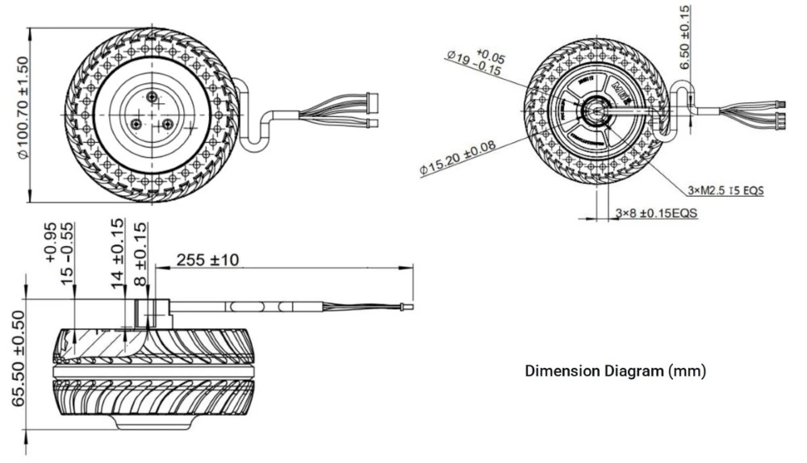
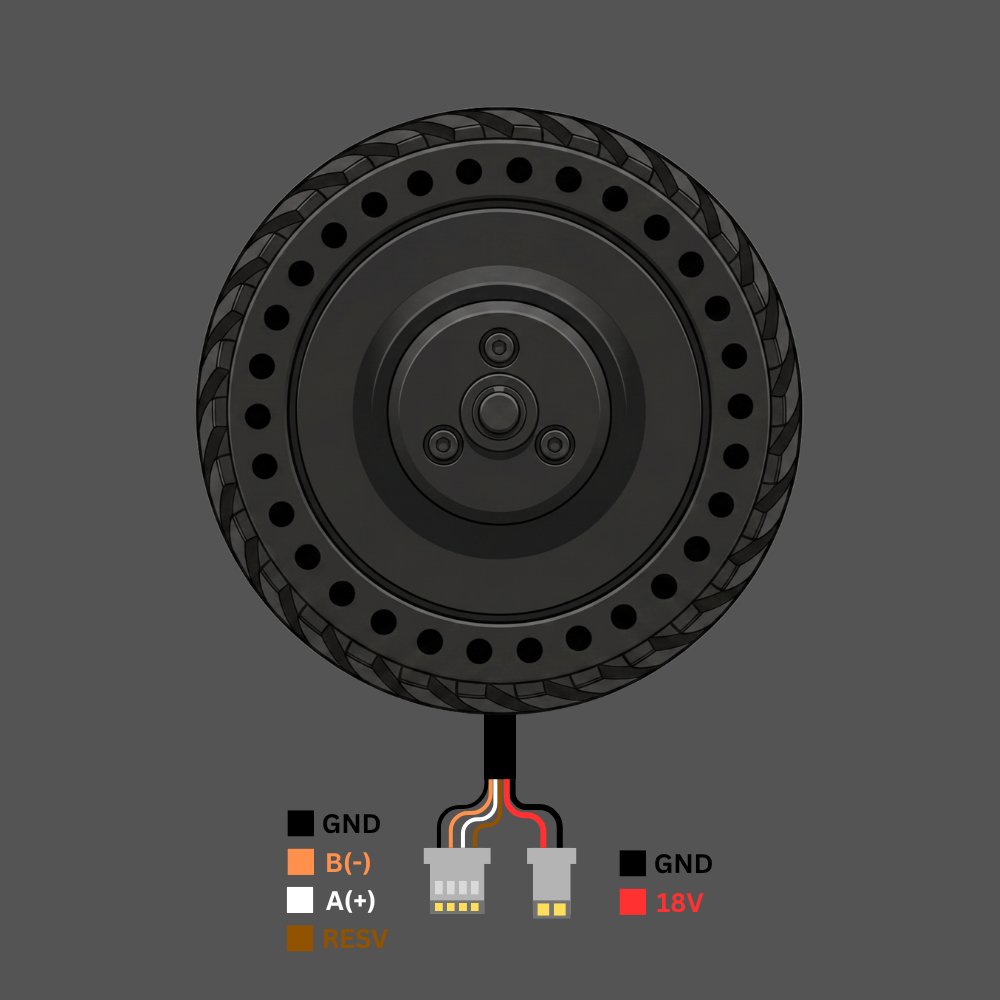
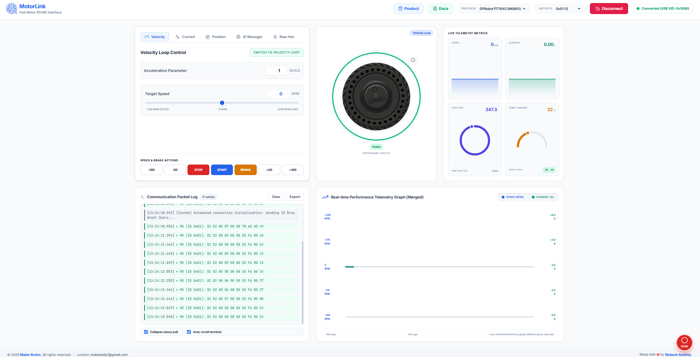
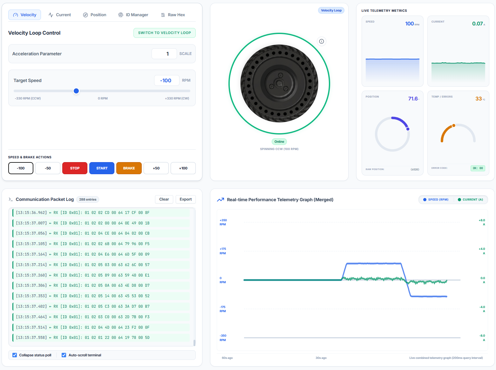

# DFRobot M0601 Hub Motor For AGV Interfacing RS485

> **Integrated FOC Servo | RS485 | Velocity · Current · Position Loop**  
> Manufactured by DFRobot · FIT1042 Series


## Supplies

- 1x M0601
- 1x Rainbowlink: https://www.dfrobot.com/product-3076.html?marketing=698d958c78dd3https://www.dfrobot.com/product-2879.html


---

## Table of Contents

1. [Motor Overview](#1-motor-overview)
2. [Versions — Left & Right Orientation](#2-versions--left--right-orientation)
3. [Specifications](#3-specifications)
4. [Applications](#4-applications)
5. [Pinout & Wiring](#5-pinout--wiring)
6. [Interfacing via RS485](#6-interfacing-via-rs485)
7. [Interfacing with RainbowLink (TEL0185)](#7-interfacing-with-rainbowlink-tel0185)
8. [Communication Protocol](#8-communication-protocol)
9. [Verified Command Reference](#9-verified-command-reference)
10. [Feedback Frame Decoding](#10-feedback-frame-decoding)
11. [Protection Rules](#11-protection-rules)
12. [Python Code Examples](#12-python-code-examples)
    - [12.1 Motor Scan](#121-motor-scan)
    - [12.2 Motor Operations](#122-motor-operations)
    - [12.3 Motor ID Change](#123-motor-id-change)
    - [12.4 Motor Parameter Monitoring](#124-motor-parameter-monitoring)
13. [MotorLink — Web Control Application](#13-motorlink--web-control-application)
14. [Safety Notice](#14-safety-notice)

---

## 1. Motor Overview



The **M0601** is a high-performance direct-drive hub motor from DFRobot's FIT1042 series. Based on an integrated FOC (Field-Oriented Control) servo architecture, it combines an outer-rotor brushless motor, encoder, and servo driver into a single compact unit — eliminating the need for external reducers and delivering smooth, low-noise torque directly to the wheel.

Unlike conventional geared motors, the M0601 uses **direct-drive technology**, meaning the wheel *is* the rotor. This gives it:

- Zero backlash and near-zero mechanical losses
- Ultra-low noise (suitable for indoor environments)
- Smooth torque at low RPM without cogging
- Precise closed-loop control at up to 500Hz command rate

Communication is entirely over **RS485** using a compact 10-byte frame protocol, making it simple to integrate with any microcontroller, single-board computer, or PC via a USB-to-RS485 adapter.

---

## 2. Versions — Left & Right Orientation

The M0601 is available in two mirror-image variants to suit different chassis and robot designs:

| Version | SKU | Mounting | Tire Pattern Direction | Typical Use |
|---|---|---|---|---|
| **Left Orientation** | FIT1042-L | Left side of chassis | Counter-clockwise tread | Left wheel of differential drive |
| **Right Orientation** | FIT1042-R | Right side of chassis | Clockwise tread | Right wheel of differential drive |

> **Note:** The rubber tires have a directional tread pattern. If you need to change the tire angle, remove the 3× M2.5×8 hex screws on the front black cover, detach the cover, remove the tire, rotate it to the correct orientation, and reinstall.

The two versions are **mechanically and electrically identical** — only the tire mounting direction differs. Either motor can be commanded to spin in either direction via the sign of the velocity/current value.

---

## 3. Specifications

| Parameter | Value |
|---|---|
| Rated Voltage | **18V DC** |
| Power Supply Range | 12V minimum / 18V rated |
| No-load Speed | 200 ± 10 RPM |
| No-load Current | ≤ 0.2A |
| Velocity Loop Range | −330 to +330 RPM |
| Current Loop Range | −32767 to +32767 (= −8A to +8A) |
| Position Loop Range | 0 to 32767 (= 0° to 360°) |
| Communication | RS485, 115200 baud, 8N1 |
| Command Rate | Up to 500Hz |
| Frame Length | 10 bytes |
| CRC Algorithm | CRC-8/MAXIM (poly x⁸ + x⁵ + x⁴ + 1) |
| Over-temperature Protection | 80°C (releases at 75°C) |
| Bus Overcurrent Protection | 3A (releases after 5s) |
| Phase Current Protection | 4.6A (releases after 5s) |
| Stall Protection | Triggers after 5s, releases after 5s |
| Mounting Thread | M2.5, 6mm deep |
| Positioning | 15.2mm diameter outer circle, 8mm flat |

---

## 4. Applications

The M0601's combination of direct drive, RS485 multi-drop, and three control modes makes it ideal for:

- **Mobile Robots** — AGV drive wheels, differential-drive and holonomic platforms
- **Balance Robots** — Precise velocity control for self-balancing systems
- **Robot Joints** — Torque-controlled arms and legs using current loop mode
- **Service Robots** — Indoor delivery, hospitality, security patrol robots
- **Fitness Equipment** — Smart resistance wheels with torque feedback
- **Camera Sliders / Gimbals** — Position loop for repeatable angular control
- **Industrial Automation** — Conveyor drive wheels on a shared RS485 bus

---

## 5. Pinout & Wiring

The motor has two cable connectors:

### Signal Cable (4-pin JST connector)

| Wire Color | Signal | Description |
|---|---|---|
| ⬛ Black | GND | Signal ground reference |
| 🟠 Orange | B (−) | RS485 differential line B |
| ⬜ White | A (+) | RS485 differential line A |
| 🟤 Brown | RESV | Shield / reserved — connect to GND |

### Power Cable (2-pin connector)

| Wire Color | Signal | Description |
|---|---|---|
| ⬛ Black | GND | Power ground |
| 🔴 Red | 18V | DC power supply positive (18V rated) |

```
Signal connector:       Power connector:
  ■ GND                   ■ GND
  ● B(-)                  ■ 18V
  ○ A(+)
  ■ RESV
```

---

## 6. Interfacing via RS485

RS485 is a differential 2-wire bus. Multiple motors can share the same A/B pair, each with a unique address (ID 0x01–0xFE).

### Connection Diagram

```
PC / Microcontroller
        │
   USB-to-RS485 Adapter
        │
   ┌────┴────┐
   A(+)   B(-)   GND
    │       │      │
   White  Orange  Black ──► Motor Signal Connector (4-pin)
                         ──► Brown wire also to GND

   18V DC power supply ──► Red/Black Power Connector (2-pin)
```

### Key Rules

1. **A/B polarity matters.** If the motor doesn't respond, swap Orange and White.
2. **Brown wire must connect to GND** — it is the RS485 signal ground reference. Leaving it floating causes communication errors, especially on longer cables.
3. **18V power is separate from the RS485 logic.** The motor will not spin without power even if RS485 communication is working.
4. **Only one motor on the bus when setting or querying IDs** — address conflicts cause garbled responses.
5. For cable runs longer than 1 metre, add a **120Ω termination resistor** across A and B at the far end of the bus.

---

## 7. Interfacing with RainbowLink (TEL0185)



The **DFRobot RainbowLink** ([TEL0185](https://www.dfrobot.com/product-2879.html)) is a 4-channel USB-to-multi-protocol converter supporting RS485, RS232, and TTL on a single USB connection. It is the recommended PC interface for the M0601.

### Step-by-step Setup

**Step 1 — Install driver**  
The RainbowLink uses a CH343 chipset. Install the driver from the DFRobot wiki or directly from WCH:
[CH343 Driver Download](http://www.wch-ic.com/downloads/CH343SER_ZIP.html)

**Step 2 — Connect wires**

| Motor Signal Wire | Connect To |
|---|---|
| Orange (B−) | A terminal on RS485 channel |
| White (A+) | B terminal on RS485 channel |
| Black (GND) | GND terminal |
| Brown (RESV) | GND terminal (recommended) |

> If the motor doesn't respond, swap Orange ↔ White — the A/B labelling on the motor is inverted relative to some converters.

**Step 3 — Identify the COM port**  
After plugging in the RainbowLink via USB:
- **Windows:** Open Device Manager → Ports (COM & LPT) → note the COM number (e.g. COM13)
- **Linux/Mac:** Run `ls /dev/tty*` and look for `/dev/ttyUSB0` or similar

**Step 4 — Serial settings**

| Setting | Value |
|---|---|
| Baud Rate | 115200 |
| Data Bits | 8 |
| Parity | None |
| Stop Bits | 1 |
| Flow Control | None / OFF |

**Step 5 — Quick test with Hercules**  
Open Hercules SETUP utility → Serial tab → configure settings above → Open.  
In the Send box, tick **HEX**, type the ID query frame, click **Send**:

```
C8 64 00 00 00 00 00 00 00 DE
```

A response in the Received window confirms the motor is wired and powered correctly.

---

## 8. Communication Protocol

All motor communication uses **10-byte frames** at 115200 baud, 8N1, half-duplex RS485.

### Send Frame Structure (Drive Command)

| Byte | Field | Description |
|---|---|---|
| DATA[0] | Motor ID | Target motor address (0x01–0xFE) |
| DATA[1] | Command type | 0x64 = drive, 0x74 = feedback query, 0xA0 = mode switch |
| DATA[2] | Value HIGH | High byte of INT16 payload |
| DATA[3] | Value LOW | Low byte of INT16 payload |
| DATA[4] | Reserved | Always 0x00 |
| DATA[5] | Reserved | Always 0x00 |
| DATA[6] | Acceleration | Valid in velocity mode; 0 = default (1 = 0.1ms/rpm) |
| DATA[7] | Brake | 0xFF = electric brake (velocity mode only); else 0x00 |
| DATA[8] | Reserved | Always 0x00 |
| DATA[9] | CRC8 | CRC-8/MAXIM of bytes DATA[0]–DATA[8] |

### CRC-8/MAXIM Algorithm

Polynomial: **x⁸ + x⁵ + x⁴ + 1** (reflected: 0x8C)

```python
def crc8_maxim(data):
    crc = 0
    for byte in data:
        crc ^= byte
        for _ in range(8):
            crc = (crc >> 1) ^ 0x8C if (crc & 0x01) else (crc >> 1)
    return crc
```

You can also verify frames at [https://crccalc.com/](https://crccalc.com/) — select **CRC-8/MAXIM**.

### Control Modes

| Mode | Mode Byte | Value Range | Unit |
|---|---|---|---|
| Current Loop | 0x01 | −32767 to +32767 | ≈ −8A to +8A |
| Velocity Loop | 0x02 | −330 to +330 | RPM |
| Position Loop | 0x03 | 0 to 32767 | 0° to 360° |

> Motor speed must be below **10 RPM** before switching to Position Loop mode.

### Polling Requirement

The motor uses a **polling protocol**. A single command does not sustain motion — the host must **repeatedly send the drive command** at ≥20ms intervals (50Hz recommended). Sending 0 RPM or the brake frame will halt the motor.

---

## 9. Verified Command Reference

All frames below are CRC-8/MAXIM verified.

### Mode Switch

| Command | Frame (10 bytes) | Notes |
|---|---|---|
| Switch to Velocity Loop | `01 A0 00 00 00 00 00 00 00 02` | Send 3–5 times. No feedback returned. |
| Switch to Current Loop | `01 A0 00 00 00 00 00 00 00 01` | Send 3–5 times. No feedback returned. |
| Switch to Position Loop | `01 A0 00 00 00 00 00 00 00 03` | Speed must be <10 RPM first. |

### Utility Commands

| Command | Frame (10 bytes) | Notes |
|---|---|---|
| Feedback Query | `01 74 00 00 00 00 00 00 00 04` | Returns 10-byte status frame |
| Brake (Velocity Mode) | `01 64 00 00 00 00 00 FF 00 D1` | Electric brake |
| ID Query (Broadcast) | `C8 64 00 00 00 00 00 00 00 DE` | Single motor on bus only |
| Set Motor ID to 0x01 | `AA 55 53 01 00 00 00 00 00 CB` | Send exactly **5 times**. One motor on bus. |

### Velocity Loop (−330 to +330 RPM)

| Speed | Frame |
|---|---|
| −100 RPM | `01 64 FF 9C 00 00 00 00 00 9A` |
| −50 RPM | `01 64 FF CE 00 00 00 00 00 DA` |
| 0 RPM | `01 64 00 00 00 00 00 00 00 50` |
| +50 RPM | `01 64 00 32 00 00 00 00 00 D3` |
| +100 RPM | `01 64 00 64 00 00 00 00 00 4F` |

### Current Loop (−32767 to +32767)

| Value | Approx. Current | Frame |
|---|---|---|
| −10000 | ~−2.44A | `01 64 D8 F0 00 00 00 00 00 78` |
| −5000 | ~−1.22A | `01 64 EC 78 00 00 00 00 00 D3` |
| −2000 | ~−0.49A | `01 64 F8 30 00 00 00 00 00 08` |
| 0 | 0A | `01 64 00 00 00 00 00 00 00 50` |
| +2000 | ~+0.49A | `01 64 07 D0 00 00 00 00 00 27` |
| +5000 | ~+1.22A | `01 64 13 88 00 00 00 00 00 A7` |
| +10000 | ~+2.44A | `01 64 27 10 00 00 00 00 00 57` |

### Position Loop (0–32767 = 0°–360°)

| Raw Value | Angle | Frame |
|---|---|---|
| 0 | 0° | `01 64 00 00 00 00 00 00 00 50` |
| 10000 | ~109.8° | `01 64 27 10 00 00 00 00 00 57` |
| 20000 | ~219.7° | `01 64 4E 20 00 00 00 00 00 5E` |
| 30000 | ~329.5° | `01 64 75 30 00 00 00 00 00 A7` |

---

## 10. Feedback Frame Decoding

The motor responds to drive commands and feedback queries with a 10-byte frame:

### Protocol 1 — Drive Command Response

| Byte | Field | Decode |
|---|---|---|
| DATA[0] | Motor ID | Responding motor's address |
| DATA[1] | Mode | 0x01=Current, 0x02=Velocity, 0x03=Position |
| DATA[2–3] | Torque Current | `int16 = (D[2]<<8)|D[3]` → Amps = value × 8 / 32767 |
| DATA[4–5] | Velocity | `int16 = (D[4]<<8)|D[5]` → RPM (signed) |
| DATA[6–7] | Position | `int16 = (D[6]<<8)|D[7]` → degrees = value × 360 / 32767 |
| DATA[8] | Error Code | Bitmask (see below) |
| DATA[9] | CRC8 | CRC-8/MAXIM of DATA[0]–DATA[8] |

### Protocol 2 — Feedback Query Response

| Byte | Field | Decode |
|---|---|---|
| DATA[6] | Winding Temperature | °C (uint8, direct) |
| DATA[7] | U8 Position | 0–255 → 0°–360° (degrees = value × 360 / 255) |

### Error Code Bitmask

| Bit | Meaning |
|---|---|
| BIT0 | Sensor error |
| BIT1 | Overcurrent error |
| BIT2 | Phase overcurrent error |
| BIT3 | Stall / locked rotor error |
| BIT4 | Troubleshooting flag |
| BIT5–7 | Reserved |

Example: `0x22` = `0b00100010` → Phase overcurrent + Overcurrent active simultaneously.

---

## 11. Protection Rules

| Protection | Threshold | Reset |
|---|---|---|
| Bus Overcurrent | 3A | Auto after 5 seconds |
| Over-temperature | 80°C | Auto when winding temp drops below 75°C |
| Phase Overcurrent | 4.6A | Auto after 5 seconds |
| Stall (Locked Rotor) | Blocked > 5s | Auto after 5 seconds |

During a protection event the motor stops responding to drive commands. The error code byte in the feedback frame indicates which protection is active.

---

## 12. Python Code Examples

> **Requirement:** Install pyserial before running any of these scripts.
> ```
> pip install pyserial
> ```
> Edit the `COM_PORT` variable at the top of each script to match your system.

---

### 12.1 Motor Scan

This script performs a two-stage scan to discover all M0601 motors on the RS485 bus.

**How it works:**
1. **Stage 1 — Broadcast query:** Sends the special ID query frame `C8 64 00 ... DE` which all motors respond to simultaneously. This gives an instant result if only one motor is connected.
2. **Stage 2 — Full poll:** Iterates through every possible address from `0x01` to `0xFE`, sending a feedback query to each and listening for a reply. This catches motors whose IDs were previously changed from the default.

The script prints a clean summary at the end listing all detected IDs, and tells you exactly what value to set `MOTOR_ID` to in the other scripts.

```python
"""
m0601_scan.py — Discover all M0601 motors on the RS485 bus.

Stage 1: Broadcast ID query (fast, ~0.3s)
Stage 2: Full poll of all IDs 0x01-0xFE (thorough, ~40s at 0.15s timeout)

Usage:
    pip install pyserial
    python m0601_scan.py
"""

import serial
import time
import sys

COM_PORT  = "COM13"       # ← Change to your port (e.g. /dev/ttyUSB0 on Linux)
BAUD_RATE = 115200
TIMEOUT   = 0.15          # Seconds to wait per ID. Increase to 0.25 on noisy buses.


def crc8_maxim(data):
    """CRC-8/MAXIM: polynomial x^8 + x^5 + x^4 + 1, reflected 0x8C."""
    crc = 0
    for byte in data:
        crc ^= byte
        for _ in range(8):
            crc = (crc >> 1) ^ 0x8C if (crc & 0x01) else (crc >> 1)
    return crc


# --- Verified frames ---
FRAME_ID_QUERY = bytes([0xC8, 0x64, 0x00, 0x00, 0x00, 0x00, 0x00, 0x00, 0x00, 0xDE])

def frame_feedback_request(motor_id):
    """Build a feedback query frame for a specific motor ID."""
    f = [motor_id, 0x74, 0x00, 0x00, 0x00, 0x00, 0x00, 0x00, 0x00]
    f.append(crc8_maxim(f))
    return bytes(f)


def stage1_broadcast(ser):
    """
    Send the broadcast ID query and parse the response.
    The motor replies with its ID in DATA[0] of the response frame.
    Returns detected ID (int) or None.
    """
    print("\n[Stage 1] Broadcast ID query...")
    ser.reset_input_buffer()
    ser.write(FRAME_ID_QUERY)
    time.sleep(0.3)

    resp = ser.read_all()
    if not resp:
        print("  No response.")
        return None

    print(f"  Raw response: {resp.hex(' ').upper()}")

    # If response is identical to our query, it's just the RS485 echo — not a motor reply.
    if bytes(resp) == FRAME_ID_QUERY:
        print("  (Echo only — motor did not respond separately)")
        return None

    # Motor reply starts with its own ID byte (0x01–0xFE)
    for byte in resp:
        if 0x01 <= byte <= 0xFE:
            print(f"  ✓ Motor found via broadcast — ID: 0x{byte:02X} ({byte})")
            return byte

    return None


def stage2_full_poll(ser):
    """
    Poll each ID from 0x01 to 0xFE individually.
    Returns a list of all responding IDs.
    """
    print("\n[Stage 2] Full ID poll (0x01 → 0xFE)...")
    print(f"  Estimated time: {254 * TIMEOUT:.0f}s — please wait.\n")
    found = []

    for motor_id in range(0x01, 0xFF):
        # Print progress bar
        pct   = motor_id / 254
        bar   = "█" * int(30 * pct) + "░" * (30 - int(30 * pct))
        print(f"\r  [{bar}] 0x{motor_id:02X} ({motor_id}/254)", end="", flush=True)

        ser.reset_input_buffer()
        ser.write(frame_feedback_request(motor_id))
        time.sleep(TIMEOUT)

        resp = ser.read_all()
        # A valid reply is 10 bytes starting with the motor's own ID
        if resp and len(resp) >= 3 and resp[0] == motor_id:
            found.append(motor_id)
            print(f"\n  ✓ Motor at ID 0x{motor_id:02X} ({motor_id}) replied!")

    print(f"\r  [{'█' * 30}] Done!                                  ")
    return found


def main():
    print("=" * 52)
    print("  M0601 Motor Scanner")
    print(f"  Port: {COM_PORT}  |  Baud: {BAUD_RATE}")
    print("=" * 52)
    print("\n  ⚠  For Stage 1, ensure only ONE motor is on the bus.")
    print("  Press Enter to start scan, Ctrl+C to cancel...")
    input()

    try:
        ser = serial.Serial(
            port=COM_PORT, baudrate=BAUD_RATE,
            bytesize=8, parity='N', stopbits=1,
            timeout=TIMEOUT
        )
        print(f"[✓] Opened {COM_PORT}")
    except serial.SerialException as e:
        print(f"[✗] Cannot open port: {e}")
        sys.exit(1)

    try:
        broadcast_id = stage1_broadcast(ser)
        polled_ids   = stage2_full_poll(ser)

        # Combine results
        all_ids = sorted(set(polled_ids) | ({broadcast_id} if broadcast_id else set()))

        print("\n" + "=" * 52)
        print("  SCAN COMPLETE")
        print("=" * 52)
        if all_ids:
            print(f"\n  {len(all_ids)} motor(s) found:")
            for mid in all_ids:
                print(f"    • ID 0x{mid:02X}  (decimal {mid})")
            if len(all_ids) == 1:
                print(f"\n  → In other scripts, set:  MOTOR_ID = 0x{all_ids[0]:02X}")
        else:
            print("\n  ✗ No motors detected.")
            print("  Checklist:")
            print("    1. Is the 18V power adapter ON?")
            print("    2. Is the Brown wire connected to GND?")
            print("    3. Try swapping Orange ↔ White (A/B polarity)")
            print(f"    4. Try increasing TIMEOUT (currently {TIMEOUT}s)")
        print("=" * 52)

    except KeyboardInterrupt:
        print("\n[!] Scan cancelled.")
    finally:
        ser.close()
        print("[✓] Port closed.")


if __name__ == "__main__":
    main()
```

---

### 12.2 Motor Operations

This script demonstrates all three control modes interactively from the keyboard — the most complete starting point for testing motor behaviour.

**How it works:**
- On startup it opens the serial port and sends the ID query to confirm the motor is online.
- It switches to **Velocity Loop** mode by default (the motor's factory default).
- A polling loop runs in the background at 50Hz, continuously sending the current command frame. This is required because the M0601 uses a polling protocol — it will not sustain motion from a single command.
- Keyboard input changes the active command, mode, or stops the motor. The polling loop picks up the new command on the very next iteration without interruption.

```python
"""
m0601_operations.py — Interactive motor control in all three modes.

Controls:
  F / B  — Forward / Backward at SPIN_RPM (velocity mode)
  1..5   — Velocity presets: 50, 100, 150, 200, 250 RPM
  S      — Stop (velocity = 0)
  K      — Brake (electric brake)
  V      — Switch to Velocity Loop mode
  C      — Switch to Current Loop mode
  P      — Switch to Position Loop mode
  I      — Query feedback (print once)
  Q      — Quit

Usage:
    pip install pyserial
    python m0601_operations.py
"""

import serial
import time
import sys
import os
import threading

COM_PORT   = "COM13"
BAUD_RATE  = 115200
MOTOR_ID   = 0x01
SPIN_RPM   = 100        # Default speed for F/B keys
POLL_HZ    = 50         # Polling frequency in Hz


def crc8_maxim(data):
    crc = 0
    for byte in data:
        crc ^= byte
        for _ in range(8):
            crc = (crc >> 1) ^ 0x8C if (crc & 0x01) else (crc >> 1)
    return crc


def build(motor_id, b1, data7):
    """Build a standard 10-byte frame: [ID, B1, 7 data bytes, CRC]."""
    f = [motor_id, b1] + list(data7)
    f.append(crc8_maxim(f))
    return bytes(f)


# ── Verified frames ───────────────────────────────────────────────────────────

def frame_velocity_mode(motor_id):
    """Switch to velocity loop (mode 0x02). No CRC on last byte — use exact bytes."""
    return bytes([motor_id, 0xA0, 0x00, 0x00, 0x00, 0x00, 0x00, 0x00, 0x00, 0x02])

def frame_current_mode(motor_id):
    """Switch to current loop (mode 0x01)."""
    return bytes([motor_id, 0xA0, 0x00, 0x00, 0x00, 0x00, 0x00, 0x00, 0x00, 0x01])

def frame_position_mode(motor_id):
    """Switch to position loop (mode 0x03). Motor must be <10 RPM first."""
    return bytes([motor_id, 0xA0, 0x00, 0x00, 0x00, 0x00, 0x00, 0x00, 0x00, 0x03])

def frame_velocity(motor_id, rpm, accel=1):
    """Velocity command. rpm: -330 to +330."""
    rpm  = max(-330, min(330, rpm))
    v    = rpm.to_bytes(2, 'big', signed=True)
    return build(motor_id, 0x64, [v[0], v[1], accel, 0x00, 0x00, 0x00, 0x00])

def frame_current(motor_id, value):
    """Current command. value: -32767 to +32767 (= -8A to +8A)."""
    value = max(-32767, min(32767, value))
    v     = value.to_bytes(2, 'big', signed=True)
    return build(motor_id, 0x64, [v[0], v[1], 0x00, 0x00, 0x00, 0x00, 0x00])

def frame_position(motor_id, pos):
    """Position command. pos: 0 to 32767 (= 0° to 360°)."""
    pos = max(0, min(32767, pos))
    v   = pos.to_bytes(2, 'big', signed=False)
    return build(motor_id, 0x64, [v[0], v[1], 0x00, 0x00, 0x00, 0x00, 0x00])

def frame_brake(motor_id):
    """Electric brake. Valid in velocity mode only."""
    return build(motor_id, 0x64, [0x00, 0x00, 0x00, 0x00, 0x00, 0xFF, 0x00])

def frame_feedback(motor_id):
    """Request full feedback (speed, current, position, temp, error)."""
    return build(motor_id, 0x74, [0x00] * 7)

def frame_id_query():
    return bytes([0xC8, 0x64, 0x00, 0x00, 0x00, 0x00, 0x00, 0x00, 0x00, 0xDE])


def decode_feedback(data):
    """Parse a 10-byte Protocol-2 feedback frame into a readable dict."""
    if len(data) < 10:
        return None
    mode_map = {0x01: "Current", 0x02: "Velocity", 0x03: "Position"}
    raw_cur  = int.from_bytes(data[2:4], 'big', signed=True)
    raw_vel  = int.from_bytes(data[4:6], 'big', signed=True)
    temp_c   = data[6]
    u8_pos   = data[7]
    err      = data[8]
    return {
        "id":       data[0],
        "mode":     mode_map.get(data[1], f"0x{data[1]:02X}"),
        "current_a": round(raw_cur * 8.0 / 32767, 3),
        "speed_rpm": raw_vel,
        "temp_c":    temp_c,
        "position_deg": round(u8_pos * 360.0 / 255, 1),
        "error":    f"0x{err:02X}" + (" (OK)" if err == 0 else " ⚠ FAULT"),
    }


def getch():
    """Read a single keypress without pressing Enter (cross-platform)."""
    if os.name == 'nt':
        import msvcrt
        return msvcrt.getch().decode('utf-8', errors='ignore').upper()
    else:
        import tty, termios
        fd  = sys.stdin.fileno()
        old = termios.tcgetattr(fd)
        try:
            tty.setraw(fd)
            return sys.stdin.read(1).upper()
        finally:
            termios.tcsetattr(fd, termios.TCSADRAIN, old)


def main():
    print("=" * 54)
    print("  M0601 Motor Operations — Interactive Control")
    print(f"  Port: {COM_PORT}  ID: 0x{MOTOR_ID:02X}  Default: {SPIN_RPM} RPM")
    print("=" * 54)

    try:
        ser = serial.Serial(
            port=COM_PORT, baudrate=BAUD_RATE,
            bytesize=8, parity='N', stopbits=1, timeout=0.3
        )
        print(f"[✓] Opened {COM_PORT}")
    except serial.SerialException as e:
        print(f"[✗] {e}")
        sys.exit(1)

    # Confirm motor is online
    print("[*] Checking for motor...")
    ser.reset_input_buffer()
    ser.write(frame_id_query())
    time.sleep(0.3)
    resp = ser.read_all()
    if resp:
        print(f"[✓] Motor responded: {resp.hex(' ').upper()}")
    else:
        print("[!] No motor response — check wiring and 18V power.")

    # Switch to velocity mode and initialise polling state
    for _ in range(5):
        ser.write(frame_velocity_mode(MOTOR_ID))
        time.sleep(0.02)
    print("[✓] Velocity loop mode set.\n")

    # Shared state between main thread (keyboard) and poll thread (serial writes)
    state = {
        "frame":   frame_velocity(MOTOR_ID, 0),   # Current frame to poll
        "polling": True,                            # Polling active flag
        "running": True,                            # Application running flag
        "mode":    "velocity",
    }
    lock = threading.Lock()

    def poll_loop():
        """Background thread: sends state['frame'] at POLL_HZ."""
        interval = 1.0 / POLL_HZ
        while state["running"]:
            with lock:
                if state["polling"]:
                    try:
                        ser.write(state["frame"])
                    except Exception:
                        pass
            time.sleep(interval)

    poll_thread = threading.Thread(target=poll_loop, daemon=True)
    poll_thread.start()

    print("Controls:")
    print("  F/B     Forward / Backward")
    print("  1-5     Speed presets (50/100/150/200/250 RPM)")
    print("  S       Stop   K  Brake")
    print("  V/C/P   Switch mode: Velocity / Current / Position")
    print("  I       Print live feedback")
    print("  Q       Quit\n")

    try:
        while True:
            print("Key: ", end="", flush=True)
            key = getch()
            print(key)

            with lock:
                if key == 'F':
                    state["frame"]   = frame_velocity(MOTOR_ID, SPIN_RPM)
                    state["polling"] = True
                    print(f"  ► Forward {SPIN_RPM} RPM")

                elif key == 'B':
                    state["frame"]   = frame_velocity(MOTOR_ID, -SPIN_RPM)
                    state["polling"] = True
                    print(f"  ◄ Backward {SPIN_RPM} RPM")

                elif key in ('1', '2', '3', '4', '5'):
                    rpm = int(key) * 50
                    state["frame"]   = frame_velocity(MOTOR_ID, rpm)
                    state["polling"] = True
                    print(f"  ► {rpm} RPM")

                elif key == 'S':
                    state["frame"]   = frame_velocity(MOTOR_ID, 0)
                    state["polling"] = True
                    print("  ■ Stopped (velocity = 0)")

                elif key == 'K':
                    state["frame"]   = frame_brake(MOTOR_ID)
                    state["polling"] = True
                    print("  ■ Brake applied")

                elif key == 'V':
                    state["mode"] = "velocity"
                    state["polling"] = False
                for _ in range(5):
                    ser.write(frame_velocity_mode(MOTOR_ID))
                    time.sleep(0.02)
                print("  ✓ Velocity Loop mode")

                elif key == 'C':
                    state["mode"] = "current"
                    state["polling"] = False
                    for _ in range(5):
                        ser.write(frame_current_mode(MOTOR_ID))
                        time.sleep(0.02)
                    state["frame"]   = frame_current(MOTOR_ID, 0)
                    state["polling"] = True
                    print("  ✓ Current Loop mode — sending 0A")

                elif key == 'P':
                    state["mode"] = "position"
                    state["polling"] = False
                    for _ in range(5):
                        ser.write(frame_position_mode(MOTOR_ID))
                        time.sleep(0.02)
                    pos = int(input("  Enter position (0–32767): "))
                    state["frame"]   = frame_position(MOTOR_ID, pos)
                    state["polling"] = True
                    print(f"  ✓ Position Loop — targeting {pos} ({pos*360/32767:.1f}°)")

                elif key == 'I':
                    state["polling"] = False
                    time.sleep(0.05)
                    ser.reset_input_buffer()
                    ser.write(frame_feedback(MOTOR_ID))
                    time.sleep(0.2)
                    resp = ser.read_all()
                    if resp and len(resp) >= 10:
                        fb = decode_feedback(resp[:10])
                        if fb:
                            print(f"  Mode:     {fb['mode']}")
                            print(f"  Speed:    {fb['speed_rpm']} RPM")
                            print(f"  Current:  {fb['current_a']} A")
                            print(f"  Position: {fb['position_deg']}°")
                            print(f"  Temp:     {fb['temp_c']} °C")
                            print(f"  Error:    {fb['error']}")
                    else:
                        print("  ✗ No feedback received")
                    state["polling"] = True

                elif key == 'Q':
                    state["frame"]   = frame_velocity(MOTOR_ID, 0)
                    time.sleep(0.1)
                    for _ in range(5):
                        ser.write(frame_brake(MOTOR_ID))
                        time.sleep(0.02)
                    state["running"] = False
                    break

    except KeyboardInterrupt:
        print("\n[!] Interrupted")
    finally:
        state["running"] = False
        time.sleep(0.1)
        ser.close()
        print("[✓] Port closed. Goodbye!")


if __name__ == "__main__":
    main()
```

---

### 12.3 Motor ID Change

This script safely changes a motor's ID address on the RS485 bus.

**How it works:**
- It first queries the bus to confirm exactly one motor is present and reads its current ID.
- It then sends the ID set frame (`AA 55 53 [NEW_ID] 00 00 00 00 00 00`) exactly **5 consecutive times** — the motor requires 5 consecutive identical frames to commit the new ID to non-volatile memory.
- After setting, it immediately sends an ID query to verify the new ID is active.

> ⚠️ **Only one motor must be connected to the bus during this operation.** If multiple motors are present, they will all receive the same new ID and conflict on the bus.

```python
"""
m0601_set_id.py — Change the RS485 ID of one M0601 motor.

⚠  Connect only ONE motor to the bus before running.
⚠  The motor saves the ID when powered off (non-volatile).

Usage:
    pip install pyserial
    python m0601_set_id.py
"""

import serial
import time
import sys

COM_PORT     = "COM13"       # ← Change to your port
BAUD_RATE    = 115200
NEW_MOTOR_ID = 0x01          # ← Change to the ID you want to assign (0x01–0xFE)


def crc8_maxim(data):
    crc = 0
    for byte in data:
        crc ^= byte
        for _ in range(8):
            crc = (crc >> 1) ^ 0x8C if (crc & 0x01) else (crc >> 1)
    return crc


# Verified broadcast ID query frame
FRAME_ID_QUERY = bytes([0xC8, 0x64, 0x00, 0x00, 0x00, 0x00, 0x00, 0x00, 0x00, 0xDE])


def build_id_set_frame(new_id):
    """
    ID set frame: AA 55 53 [ID] 00 00 00 00 00 00
    Note: This frame has NO CRC — the last byte is always 0x00.
    Must be sent exactly 5 times in a row.
    """
    assert 0x01 <= new_id <= 0xFE, "ID must be 0x01 to 0xFE"
    return bytes([0xAA, 0x55, 0x53, new_id, 0x00, 0x00, 0x00, 0x00, 0x00, 0x00])


def query_current_id(ser):
    """Send broadcast query and return the detected motor ID, or None."""
    ser.reset_input_buffer()
    ser.write(FRAME_ID_QUERY)
    time.sleep(0.3)
    resp = ser.read_all()
    if not resp or bytes(resp) == FRAME_ID_QUERY:
        return None
    # Motor ID is the first non-echo byte in the 0x01–0xFE range
    for byte in resp:
        if 0x01 <= byte <= 0xFE:
            return byte
    return None


def main():
    print("=" * 52)
    print("  M0601 Motor ID Changer")
    print(f"  Port: {COM_PORT}  →  New ID: 0x{NEW_MOTOR_ID:02X} ({NEW_MOTOR_ID})")
    print("=" * 52)
    print()
    print("  ⚠  ONLY ONE MOTOR MUST BE CONNECTED TO THE BUS.")
    print("  ⚠  The new ID is saved permanently (survives power-off).")
    print()

    try:
        ser = serial.Serial(
            port=COM_PORT, baudrate=BAUD_RATE,
            bytesize=8, parity='N', stopbits=1, timeout=0.3
        )
        print(f"[✓] Opened {COM_PORT}")
    except serial.SerialException as e:
        print(f"[✗] Cannot open port: {e}")
        sys.exit(1)

    # Step 1: Confirm one motor is present and read current ID
    print("\n[Step 1] Scanning for motor...")
    current_id = query_current_id(ser)
    if current_id is None:
        print("[✗] No motor detected.")
        print("    Check: 18V power ON? Wiring correct? Brown wire to GND?")
        ser.close()
        sys.exit(1)

    print(f"[✓] Motor detected — current ID: 0x{current_id:02X} ({current_id})")

    if current_id == NEW_MOTOR_ID:
        print(f"[!] Motor already has ID 0x{NEW_MOTOR_ID:02X}. Nothing to do.")
        ser.close()
        sys.exit(0)

    # Step 2: Confirm with user
    print(f"\n[Step 2] Ready to change ID: 0x{current_id:02X} → 0x{NEW_MOTOR_ID:02X}")
    confirm = input("  Type 'yes' to confirm: ").strip().lower()
    if confirm != 'yes':
        print("[!] Cancelled.")
        ser.close()
        sys.exit(0)

    # Step 3: Send ID set frame exactly 5 times
    print("\n[Step 3] Sending ID set frame ×5...")
    id_frame = build_id_set_frame(NEW_MOTOR_ID)
    print(f"  Frame: {id_frame.hex(' ').upper()}")

    for i in range(1, 6):
        ser.write(id_frame)
        print(f"  Sent {i}/5")
        time.sleep(0.05)   # Small gap between frames

    print("\n[Step 4] Waiting for motor to save ID (power-cycle not needed)...")
    time.sleep(0.5)

    # Step 4: Verify new ID
    print("[Step 4] Verifying new ID...")
    verified_id = query_current_id(ser)

    if verified_id == NEW_MOTOR_ID:
        print(f"\n[✓] SUCCESS — Motor ID is now 0x{NEW_MOTOR_ID:02X} ({NEW_MOTOR_ID})")
        print(f"    Update MOTOR_ID = 0x{NEW_MOTOR_ID:02X} in your other scripts.")
    elif verified_id is not None:
        print(f"\n[✗] Motor responded with ID 0x{verified_id:02X} — ID change may have failed.")
        print("    Try power-cycling the motor and running this script again.")
    else:
        print("\n[?] No response after ID change.")
        print("    Try power-cycling the motor — the new ID may have been saved.")
        print(f"    Run m0601_scan.py after power-cycling to confirm.")

    ser.close()
    print("[✓] Port closed.")


if __name__ == "__main__":
    main()
```

---

### 12.4 Motor Parameter Monitoring

This script continuously polls the motor's feedback frame and prints a live terminal dashboard showing all real-time parameters: speed, current, position, winding temperature, and fault status.

**How it works:**
- Sends the Protocol-2 feedback query frame (`01 74 00 ... 04`) at a configurable interval (default 200ms).
- Parses each 10-byte response to extract: mode, torque current (INT16 → Amps), velocity (INT16 → RPM), winding temperature (°C), angular position (U8 → degrees), and the error code bitmask.
- Decodes the error bitmask into named fault descriptions.
- Prints an updating single-line dashboard that overwrites itself in the terminal.
- Logs all readings to a CSV file for later analysis.

```python
"""
m0601_monitor.py — Live parameter monitoring with CSV logging.

Polls the motor feedback at configurable interval and displays:
  Mode | Speed (RPM) | Current (A) | Position (°) | Temp (°C) | Errors

Also writes all readings to motor_log.csv for offline analysis.

Usage:
    pip install pyserial
    python m0601_monitor.py
    Press Ctrl+C to stop.
"""

import serial
import time
import sys
import csv
import os
from datetime import datetime

COM_PORT      = "COM13"     # ← Change to your port
BAUD_RATE     = 115200
MOTOR_ID      = 0x01
POLL_INTERVAL = 0.2         # Seconds between feedback queries (5Hz default)
LOG_FILE      = "motor_log.csv"


def crc8_maxim(data):
    crc = 0
    for byte in data:
        crc ^= byte
        for _ in range(8):
            crc = (crc >> 1) ^ 0x8C if (crc & 0x01) else (crc >> 1)
    return crc


def frame_feedback_query(motor_id):
    """Protocol 2 feedback request: returns speed, current, temp, position, error."""
    f = [motor_id, 0x74, 0x00, 0x00, 0x00, 0x00, 0x00, 0x00, 0x00]
    f.append(crc8_maxim(f))
    return bytes(f)


def decode_error(code):
    """Decode error bitmask into a human-readable string."""
    if code == 0:
        return "OK"
    errors = []
    if code & 0x01: errors.append("SensorErr")
    if code & 0x02: errors.append("Overcurrent")
    if code & 0x04: errors.append("PhaseOvercurrent")
    if code & 0x08: errors.append("Stall")
    if code & 0x10: errors.append("Troubleshoot")
    return " | ".join(errors)


def parse_feedback(data):
    """
    Parse a 10-byte Protocol-2 feedback frame.
    Returns a dict with all motor parameters, or None on invalid data.
    """
    if len(data) < 10:
        return None

    motor_id = data[0]
    mode_raw = data[1]
    mode_map = {0x01: "Current ", 0x02: "Velocity", 0x03: "Position"}
    mode_str = mode_map.get(mode_raw, f"Unk(0x{mode_raw:02X})")

    # Torque current: signed INT16, big-endian, bytes 2-3
    raw_current = int.from_bytes(data[2:4], byteorder='big', signed=True)
    current_a   = round(raw_current * 8.0 / 32767.0, 3)

    # Velocity: signed INT16, big-endian, bytes 4-5
    speed_rpm = int.from_bytes(data[4:6], byteorder='big', signed=True)

    # Winding temperature: uint8, byte 6
    temp_c = data[6]

    # U8 position: uint8, byte 7 — 0-255 maps to 0°-360°
    u8_pos       = data[7]
    position_deg = round(u8_pos * 360.0 / 255.0, 1)

    # Error code bitmask: byte 8
    error_raw = data[8]
    error_str = decode_error(error_raw)

    return {
        "timestamp":    datetime.now().strftime("%H:%M:%S.%f")[:-3],
        "motor_id":     motor_id,
        "mode":         mode_str,
        "speed_rpm":    speed_rpm,
        "current_a":    current_a,
        "temp_c":       temp_c,
        "position_deg": position_deg,
        "error_code":   f"0x{error_raw:02X}",
        "error_str":    error_str,
        "raw_hex":      data[:10].hex(' ').upper(),
    }


def print_dashboard(fb, count):
    """Print a compact, self-overwriting dashboard line."""
    fault_indicator = "🔴 FAULT" if fb['error_str'] != "OK" else "🟢 OK   "
    line = (
        f"\r[{fb['timestamp']}] #{count:5d} | "
        f"Mode: {fb['mode']} | "
        f"Speed: {fb['speed_rpm']:+5d} RPM | "
        f"Current: {fb['current_a']:+6.3f} A | "
        f"Pos: {fb['position_deg']:6.1f}° | "
        f"Temp: {fb['temp_c']:3d}°C | "
        f"{fault_indicator}"
        + (f" ({fb['error_str']})" if fb['error_str'] != "OK" else "")
    )
    print(line, end="", flush=True)


def main():
    print("=" * 70)
    print("  M0601 Motor Parameter Monitor")
    print(f"  Port: {COM_PORT}  |  Motor ID: 0x{MOTOR_ID:02X}  |  Poll: {POLL_INTERVAL*1000:.0f}ms")
    print(f"  Logging to: {os.path.abspath(LOG_FILE)}")
    print("=" * 70)
    print("  Press Ctrl+C to stop.\n")

    try:
        ser = serial.Serial(
            port=COM_PORT, baudrate=BAUD_RATE,
            bytesize=8, parity='N', stopbits=1, timeout=0.3
        )
        print(f"[✓] Opened {COM_PORT}")
    except serial.SerialException as e:
        print(f"[✗] Cannot open port: {e}")
        sys.exit(1)

    query_frame = frame_feedback_query(MOTOR_ID)
    count        = 0
    no_resp_count = 0

    # Open CSV log file
    csv_fields = [
        "timestamp", "motor_id", "mode", "speed_rpm",
        "current_a", "temp_c", "position_deg",
        "error_code", "error_str", "raw_hex"
    ]
    log_file = open(LOG_FILE, 'w', newline='')
    writer   = csv.DictWriter(log_file, fieldnames=csv_fields)
    writer.writeheader()

    print(f"\n{'Timestamp':14s} {'#':>6s}  Mode      Speed    Current  Position  Temp  Status")
    print("-" * 80)

    try:
        while True:
            ser.reset_input_buffer()
            ser.write(query_frame)
            time.sleep(POLL_INTERVAL)

            resp = ser.read_all()
            if not resp or len(resp) < 10:
                no_resp_count += 1
                if no_resp_count >= 5:
                    print(f"\r[!] No response for {no_resp_count} consecutive polls — check motor power.", end="")
                continue

            no_resp_count = 0
            count += 1
            fb = parse_feedback(resp[:10])
            if not fb:
                continue

            print_dashboard(fb, count)
            writer.writerow({k: fb[k] for k in csv_fields})
            log_file.flush()

    except KeyboardInterrupt:
        print("\n\n[✓] Monitoring stopped.")
    finally:
        log_file.close()
        ser.close()
        print(f"[✓] Log saved to {LOG_FILE}")
        print(f"[✓] {count} readings recorded.")
        print("[✓] Port closed.")


if __name__ == "__main__":
    main()
```

**Sample terminal output:**
```
[13:15:36.962] #  288  Mode: Velocity | Speed:  +100 RPM | Current:  +0.070 A | Pos:  71.6° | Temp:  33°C | 🟢 OK
```

**Sample CSV output:**
```
timestamp,motor_id,mode,speed_rpm,current_a,temp_c,position_deg,error_code,error_str,raw_hex
13:15:36.962,1,Velocity,100,0.07,33,71.6,0x00,OK,01 02 00 0A 00 64 21 59 00 F5
```

---

## 13. MotorLink — Web Control Application

Working with raw RS485 hex frames manually is error-prone and slow. To solve this, **MotorLink** was built as a free, open browser-based application that handles all the protocol complexity automatically.

**🔗 Live App: [https://mukeshsankhla.github.io/MotorLink/](https://mukeshsankhla.github.io/MotorLink/)**





### Compatible Motors

| Motor | Manufacturer | Protocol |
|---|---|---|
| M0601 (FIT1042) | DFRobot | Supported ✅ |
| DDSM115 | Waveshare | Supported ✅ |

### How It Works

MotorLink runs entirely in the browser using the **Web Serial API** — no installation, no backend, no drivers beyond the USB-RS485 adapter driver.

```
Browser (MotorLink) ──► Web Serial API ──► COM Port ──► RainbowLink TEL0185 ──► RS485 ──► M0601 Motor
```

### Getting Started

1. Connect the M0601 to your RainbowLink as described in [Section 7](#7-interfacing-with-rainbowlink-tel0185)
2. Power the motor from an **18V DC** supply
3. Open **[https://mukeshsankhla.github.io/MotorLink/](https://mukeshsankhla.github.io/MotorLink/)** in Chrome or Edge
4. Click **Connect**, select your COM port from the browser dialog, click **Open**
5. MotorLink automatically sends an ID query and reads the motor's current parameters — the UI adjusts itself to match the motor's active mode

> ⚠️ Web Serial API is supported in **Chrome 89+ and Edge 89+** only. Firefox and Safari are not supported.

### Features

#### 🔌 Auto-initialization
On connect, MotorLink automatically sends the broadcast ID query and reads the motor's current operating mode. The UI sets itself to match — no manual configuration needed.

#### 🌀 Digital Twin Motor Visualization
The centre panel displays a real-time **digital twin** of the physical motor — a rendered hub wheel that rotates in sync with the actual motor. The rotation speed, direction (CW/CCW), and status (STATIONARY / SPINNING / BRAKING) all reflect the live feedback from the motor. When the motor spins at 100 RPM counter-clockwise, the on-screen wheel spins at the same rate and direction, giving you an immediate visual confirmation of what the physical motor is doing without looking away from the interface.

#### ⚡ Velocity Loop Control
- RPM slider: −330 to +330
- Quick action buttons: −100, −50, **STOP**, **START**, **BRAKE**, +50, +100
- Configurable acceleration parameter
- Polls at 50Hz while active
- Electric brake with a single click

#### 🔋 Current Loop Control
- Current slider: −32767 to +32767 (displayed as Amps)
- Preset buttons for common torque values
- Ideal for torque-controlled applications like robot joints and exoskeletons

#### 🎯 Position Loop Control
- Target position input with raw value and live degree display
- Commands the motor to rotate to an exact angular position
- Motor speed must be below 10 RPM before switching to this mode

#### 🪪 ID Manager
- **Scan** — broadcasts ID query and reports detected motor with its current ID
- **Full scan** — polls all addresses 0x01–0xFE to find all motors on the bus
- **Set ID** — change motor address; sends the command 5× automatically and shows a single-motor warning before proceeding

#### 📡 Raw Hex Editor
- Type any 9-byte command frame in hex
- CRC-8/MAXIM automatically computed and appended, showing the full 10-byte frame
- Send once or in a configurable repeating loop

#### 📊 Live Telemetry Metrics
- **Speed** — real-time RPM value + mini line chart
- **Current** — real-time Amps value + mini line chart
- **Position** — raw value + degrees + circular dial gauge that mirrors the motor's actual angle
- **Temperature** — winding temperature in °C with a gauge arc
- **Error Code** — displayed as hex with decoded fault names (Overcurrent, Stall, Phase Overcurrent, Sensor Error)

#### 📈 Real-time Performance Graph
Combined speed and current telemetry plotted on a shared time axis, updating at 200ms intervals. The graph retains the last 60 seconds of data, making it easy to observe acceleration ramps, load changes, and thermal step responses.

#### 📋 Communication Packet Log
- Every sent and received frame logged with millisecond-precision timestamps
- Colour-coded entries: TX (blue) / RX (green) / System (grey) / Error (red)
- **Collapse status poll** checkbox — suppresses high-frequency polling entries so you can read meaningful events without scrolling through thousands of identical lines
- **Auto-scroll** checkbox — keeps the log pinned to the latest entry
- **Export** button — download the full log as a CSV file for offline analysis

---

## 14. Safety Notice

> ⚠️ **Read before operating the motor.**

- The motor will start rotating after certain commands are sent. **Do not touch any rotating parts.**
- If the motor is not secured to a frame or chassis, **always be ready to cut power immediately.**
- **Start with low speeds** (50–100 RPM) when testing for the first time.
- The motor generates significant torque. Ensure it is firmly mounted before commanding movement.
- In case of unexpected behaviour, use the **red STOP button** in MotorLink, or disconnect the 18V power supply.
- **Never exceed 18V** on the power supply.
- Allow the motor to cool if the winding temperature exceeds 70°C — protection triggers at 80°C.
- The motor must be stationary (< 10 RPM) before switching to Position Loop mode.

---

## Appendix: Quick Reference Card

### Minimum Steps to Spin the Motor

```
1. Wire:  White→A,  Orange→B,  Black→GND,  Brown→GND
2. Power: 18V DC to Red/Black power connector
3. Set velocity mode:  01 A0 00 00 00 00 00 00 00 02  (send ×5)
4. Spin at 100 RPM:    01 64 00 64 00 00 00 00 00 4F  (poll at 50Hz)
5. Stop:               01 64 00 00 00 00 00 00 00 50  (send ×5)
6. Brake:              01 64 00 00 00 00 00 FF 00 D1  (send ×5)
```

### Conversion Formulas

```python
# Velocity (INT16 signed)
frame_val = target_rpm                            # -330 to +330
high, low = (frame_val >> 8) & 0xFF, frame_val & 0xFF

# Current (INT16 signed)
current_amps = raw_int16 * 8.0 / 32767           # decode
raw_int16    = int(current_amps / 8.0 * 32767)   # encode

# Position (UINT16)
degrees   = raw_uint16 * 360.0 / 32767           # decode
raw_uint16 = int(degrees / 360.0 * 32767)        # encode
```

---

*Documentation prepared for the M0601 Direct-Drive Hub Motor (DFRobot FIT1042) and MotorLink web application.*  
*Compatible with Waveshare DDSM115.*  
*Protocol reference: [https://wiki.dfrobot.com/fit1042/docs/23322](https://wiki.dfrobot.com/fit1042/docs/23322)*  
*Made with ❤ by Mukesh Sankhla*
